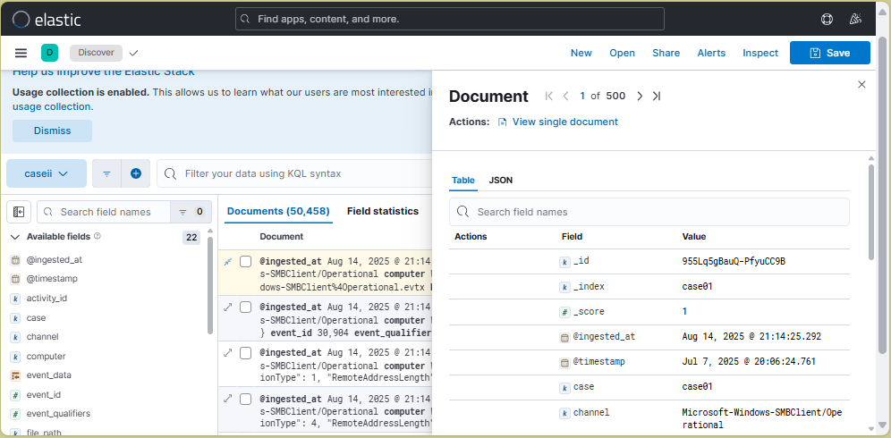

# EVTX to ELK (Docker Compose)

This repository provides a minimal ELK stack with refreshed ingestor everytime you start the stack. The ingestor converts EVTX files, parses the lines and indexes them into Elasticsearch.



## Setup Flow >

1. When you start with `docker compose up`, Elasticsearch and Kibana start.
2. The `ingestor` container will wait for Elasticsearch.
3. It deletes all non-system indices to clear any existing data, then ingests EVTX files from `./data/<DirName>/*.evtx` into an index named `<DirName>`. The directory name could be:
   - CaseName
   - Computer_Name
   - User_Name
   - etc. You do you ofc.
    > _**Example:**_ `./data/Case01/*.evtx` -> index `Case01`.

**Notes:**

- XPack is disabled for simplicity of setup and because it's designed to be rebuilt over and over. (not for scaled production).
- Theres an attempt to map the xml.
  You can extend parsing later.

## Usage (PowerShell)

```powershell
## Make ./data Directory
# Copy your Logs folder into ./data
# winevt/Logs/*.evtx --> ./data/Case01/*.evtx

## Any ndjson files in the saved_objects will be added
# *.ndjson --> ./saved_objects/*.ndjson

docker compose up -d

# Open Kibana
# http://localhost:5601
```

## Customization

There is `no .env` file by default. You can use your own `.env` or just change it in the `docker-compose.yml`.

- Change bulk size by editing `BULK_SIZE` in `docker-compose.yml` (env var).
- Add more case folders under `./data` to create more indices.

## Troubleshooting

```bash
docker compose logs -f 20 ingestor
```

- If ingestion seems slow, EVTX files can be large; watch logs of `evtx-ingestor`.
- Elasticsearch memory limits can be tuned via `ES_JAVA_OPTS` in `docker-compose.yml`.


## Potential ToDo

- Add Dashboards objects
- Implement A few alerts templates
- Add MFT support
- Add Registry Support
